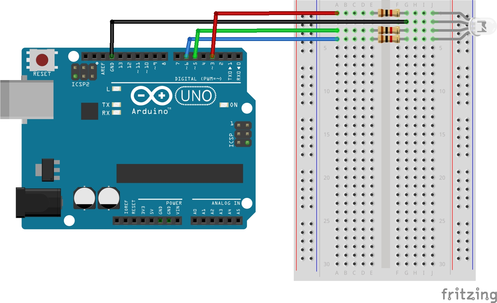

# Lekcja 1: Podstawy RGB
Podstawowe ćwiczenie z kursu **Arduino cz. 2** z strony **Forbot**.

### Czego się nauczyłem:
* Dzisiaj dowiedziałem się co to dioda RGB.
* Nauczyłem się ją podłączać do Arduino.
* Zaprogramowałem ją za pomocą funkcji `digitalWrite()`. Przez co każdy kolor świecił z maksymalną jasnością.
* Zrobiłem schemat w programie fritzing.

### Pliki w projekcie:
* `01_podstawy_RGB.ino` - Kod programu
* `schemat_podstawy_RGB.jpg` - Schemat połączeń (Fritzing)
* `GIF_wideo_podstawy_RGB.gif` - Prezentacja działania

### Schemat połączeń:

### Prezentacja działania:

