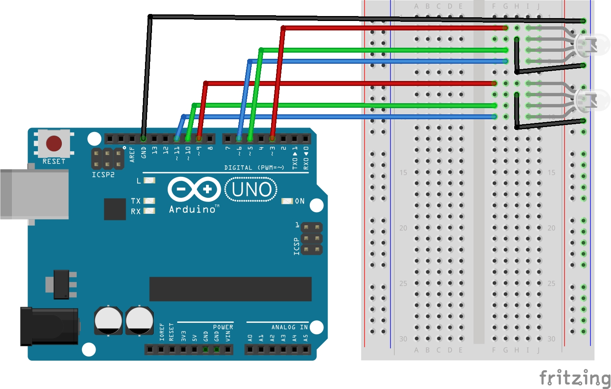

# Lekcja 2: Miganie dwoma diodami RGB
Podstawowe ćwiczenie oraz kontynuacja kursu **Arduino cz. 2** z strony **Forbot**.

### Czego się nauczyłem:
* Poznałem ograniczenia Arduino jako sterownika do diod RGB (jedna dioda RGB potrzebuje aż 3 wyjść PWM, a Arduino posiada ich tylko 6).
* Zaprogramowałem dwie diody RGB.
* Zrobiłem schemat w programie fritzing.

### Pliki w projekcie:
* '02_miganie_dwoma_diodami_RGB.ino' - Kod programu
* 'schemat_miganie_dwoma_diodami_RGB.jpg' - Schemat połączeń (Fritzing)
* 'GIF_miganie_dwoma_diodami_RGB' - Prezentacja działania

### Schemat połączeń:

### Prezentacja działania:

