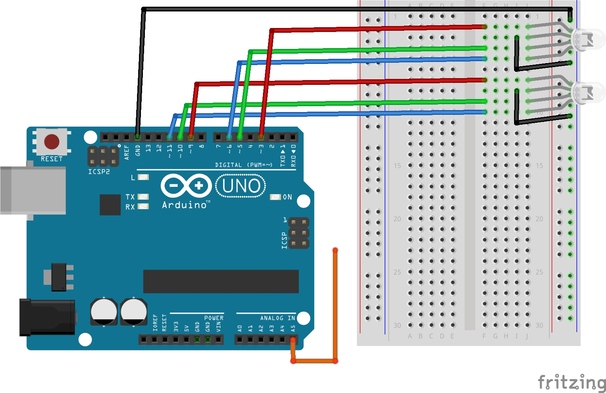

# Lekcja 3: Płynna zmiana kolorów dwoma diodami RGB
Podstawowe ćwiczenie i kontynuacja kursu **Arduino cz. 2** z strony **Forbot**.

### Czego się nauczyłem:
* Dowiedziałem się jak stworzyć dowolny kolor diodą RGB (nie tylko czerwony, zielony i niebieski) przez wykorzystanie sygnału PWM.
* Piny PWM w Arduino mają rozdzielczość 8-bitową, to znaczy że można uzyskać 256 x 256 x 256 = 16777216 kombinacji kolorów!
* Nauczyłem się generować sygnał PWM za pomocą funkcji `analogWrite()`.
* Wykorzystałem funkcję `random()` aby diody RGB świeciły na randomowe kolory.
* Aby uniknąć pseudo losowości w funkcji `randomSeed()` umieściłem sygnał z anteny (która jest po prostu wystającym kablem z pinu analogowego) który działa jako ziarno dla generatora liczb losowych dzięki czemu za każdym uruchomieniem seed będzie inny (antena zbiera zakłucenia z otocznia których jest zazwyczaj sporo i przekształca je jako ziarno).

* Zrobiłem schemat w programie Fritzing.

### Pliki w projekcie:
* `03_plynna_zmiana_kolorow_dwoma_diodami_RGB` - Kod programu
* `schemat_plynna_zmiana_kolorow_dwoma_diodami_RGB` - Schemat połączeń (Fritzing)
* `GIF_plynna_zmiana_kolorow_dwoma_diodami_RGB` - Prezentacja działania

### Schemat połączeń:

### Prezentacja działania:

