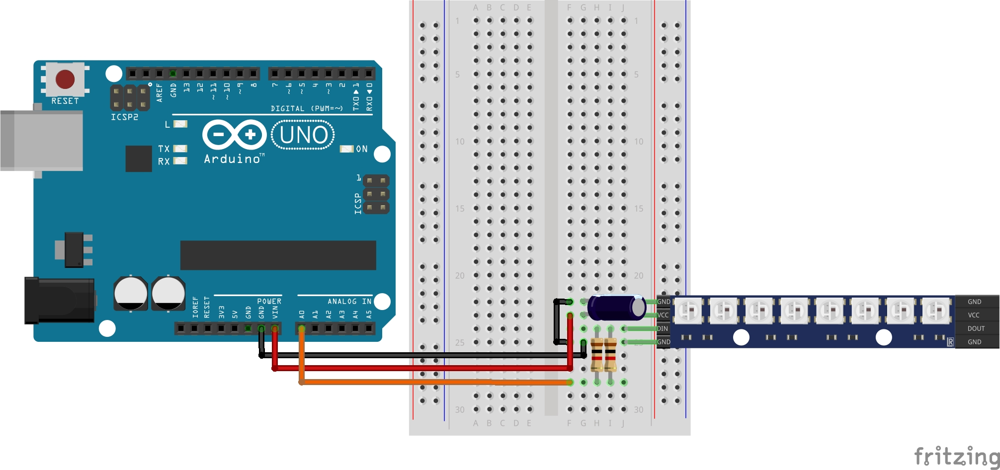

# Lekcja 4: Podstawy diod programowalnych
Podstawowe ćwiczenie i początek diod programowalnych z kursu **Arduino cz. 2** z strony **Forbot**.

### Czego się nauczyłem:
* Dowiedziałem się co to diody programowalne. Są to diody które wewnątrz siebie mają wbudowany sterownik.
* W lekcji 2 napisałem ze Arduino posiada ograniczenie co do sterowania diodami RGB przez liczbę pinów PWM, które są w stanie obsłużyć maksymalnie 2 diody RGB. Dzięki diodą programowalnym możemy ich podpiąć znacznie więcej korzystająć z tylko jednego pinu analogowego!
* Poraz pierwszy dodałem bibliotekę przy pomocy funkcji `#include`.
* Wiem jak skonfigurować moduł diod programowalnych **WS2812** i ustawić wybrany kolor na wybranej diodzie.
* W sekcji `void setup()` kluczowe jest wywołanie funkcji `nazwa.begin()`. Służy ona do **inicjalizacji komunikacji** z paskiem LED – bez jej wywołania mikrokontroler nie zacznie wysyłać sygnałów sterujących na pin danych.
* żeby fizycznie wysłać dane z pamięci Arduino do paska LED używamy `nazwa.show()`.

### Konfiguracja diod programowalnych
W projekcie użyłem biblioteki `Adafruit_NeoPixel`. Kluczowa linijka definiująca pasek to:
`Adafruit_NeoPixel nazwa = Adafruit_NeoPixel(8, A0, NEO_GRB + NEO_KHZ800);`

**Parametry funkcji:**
* `8` – liczba zadeklarowanych diod w pasku.
* `A0` – pin sygnałowy (Data).
* `NEO_GRB` – kolejność kolorów (w większości pasków WS2812B jest to właśnie GRB).
* `NEO_KHZ800` – protokół komunikacji (częstotliwość 800 kHz).

### Sterowanie kolorami pikseli
Do ustawienia koloru konkretnej diody służy złożona funkcja:
`nazwa.setPixelColor(0, nazwa.Color(0, 255, 0));`

**Rozbicie komendy:**
* `setPixelColor(indeks, kolor)` – wybiera diodę (indeks `0` to pierwsza dioda od strony przewodu sygnałowego).
* `Color(R, G, B)` – funkcja pomocnicza tworząca kolor z palety RGB (wartości od `0` do `255`).
* W powyższym przykładzie dioda nr 1 zostaje ustawiona na kolor **zielony**.

**Ważne:** Samo wywołanie tej funkcji nie zapali diody! Kolor zostanie tylko zapisany w pamięci. Aby go wyświetlić, należy później wywołać `nazwa.show();`.

### Pliki w projekcie:
* '04_podstawy_diod_programowalnych.ino' - Kod programu
* 'schemat_podstawy_diod_programowalnych.jpg' - Schemat połączeń (Fritzing)
* 'GIF_podstawy_diod_programowalnych.gif' - Prezentacja działania

### Schemat połączeń:

### Prezentacja działania:

