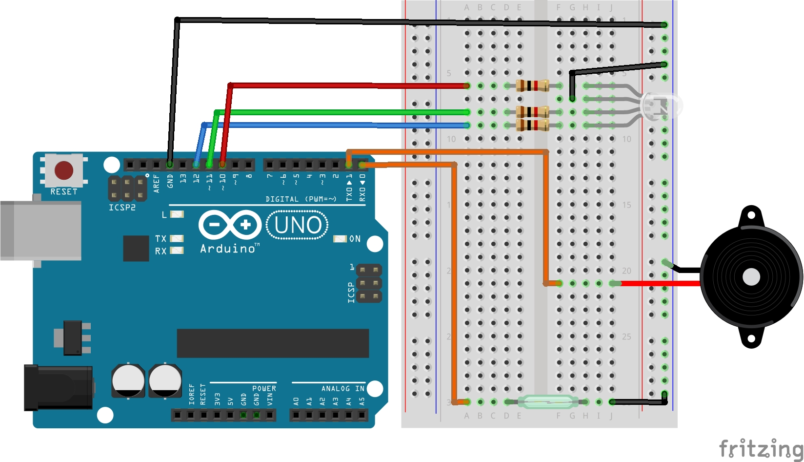

# Lekcja 7: Alarm otwarcia okna
Podstawowe ćwiczenie z kursu **Arduino cz. 2** od **Forbot**. 
Symulacja alarmu otwarcia okna z urzyciem kontaktrona, diody RGB i buzzera pasywnego.

### Czego się nauczyłem:
* Połączyłem wcześniej poznane komponenty do stworzenia jednego większego projektu.
* Warto zwrócić uwagę na podłączanie komponentów pod piny 0 i 1 które są jednocześnie odpowiedzialne za komunikacje UART. 
  Gdy podłączyłem zwarty kontaktron do pinu 0 (RX) i chciałem zaprogramować Arduino wyskakiwał mi błąd.
* Niestety GitHub nie pozwala na dodawanie dźwięku, ale musicie zaufać, że po przerwaniu kontaktrona buzzer wydaje głośny dźwięk aż do resetu Arduino. 

### Pliki w projekcie:
* `07_alarm_otwarcia_okna.ino` - Kod programu
* `schemat_alarm_otwarcia_okna.jpg` - Schemat połączeń (Fritzing)
* `gif_alarm_otwarcia_okna.gif` - Prezentacja działania

### Schemat połączeń:

### Prezentacja działania:

