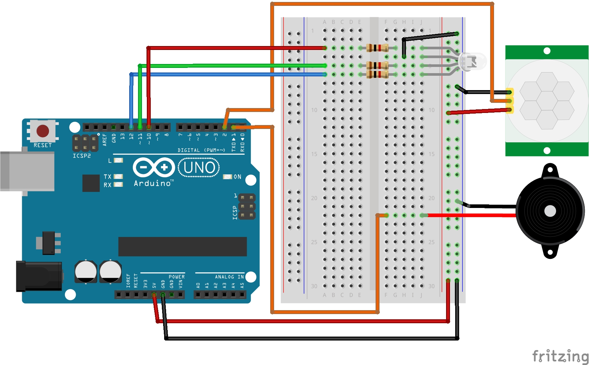

# Lekcja 8: Czujnik ruchu PIR
Podstawowe ćwiczenie z kursu **Arduino cz. 2** z strony **Forbot**. Dzisiaj zająłem się czujnikiem ruchu PIR CH-SR501.

### Czego się nauczyłem:
* Dowiedziałem się jak działa czujnik PIR.
* Zaprogramowałem identyczny program jak w lekcji 7 tylko zamiast kontaktrona użyłem czujnika PIR.
* Program ma symulować wykrywanie przechodzących ludzi tak jak w niektórych mniejszych sklepach informując sprzedawcę o przyjściu klienta.
* Połączyłem diodę RGB która zmienia się z zielonego koloru na czerwono z buzzerem który gra melodyjkę kiedy ktoś przechodzi(w prezentacji działania tego nie słychać ale musicie uwierzyć na słowo).

### Jak działa czujnik ruchu PIR (HC-SR501):
Czujnik PIR (Passive InfraRed) nie wysyła żadnego sygnału, a jedynie "nasłuchuje". Wykrywa on zmiany promieniowania podczerwonego (ciepła) w swoim polu widzenia.
* **Zasada działania:** Sensor reaguje na ruch obiektów, które mają temperaturę inną niż otoczenie (np. człowiek lub zwierzę).
* **Regulacja:** Moduł posiada dwa potencjometry. Jeden odpowiada za **czułość** (zasięg wykrywania), a drugi za **czas podtrzymania** sygnału wysokiego po wykryciu ruchu (Time Delay).
* **Sygnał wyjściowy:** Gdy czujnik wykryje ruch, na pinie wyjściowym (OUT) pojawia się stan wysoki (**5V**). Możemy go łatwo odczytać za pomocą funkcji `digitalRead()`.

### Pliki w projekcie:
* `08_czujnik_ruchu_PIR.ino` - Kod programu
* `schemat_czujnik_ruchu_PIR.jpg` - Schemat połączeń (Fritzing)
* `gif_czujnik_ruchu_PIR.gif` - Prezentacja działania

### Schemat połączeń:

### Prezentacja działania:

