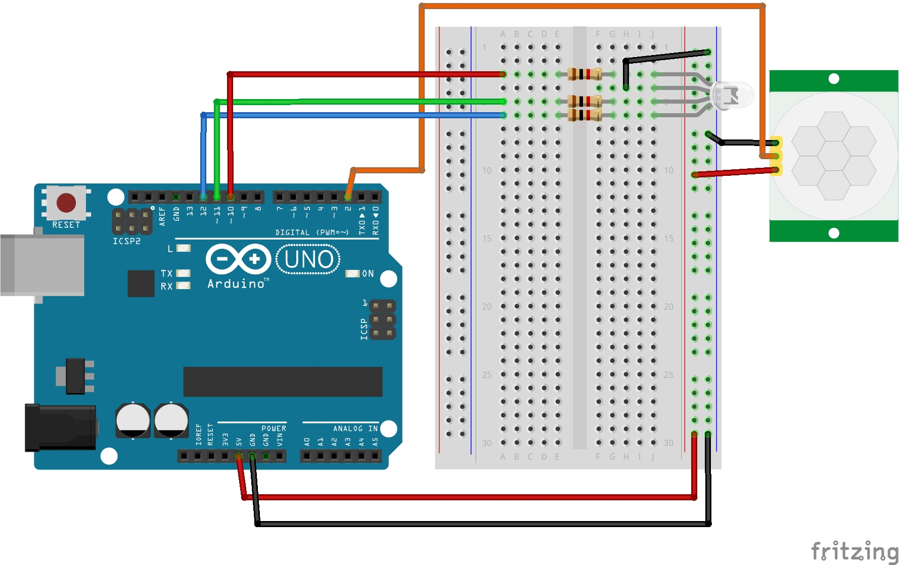

# Lekjca 10: Przerwania cz. 2
Kontynuacja przerwań z kursu **Arduino cz. 2** od **Forbot**. Na podstawie projektu z poprzedniej lekcji zrobiłem nowy który delikatnie poszerza temat.

### Czego się nauczyłem:
* Poznałem przedrostek `volatile` i dowiedziałem się jak go stosować.
* wykorzystałem poprzedni projekt do przedstawienia zastosowania przedrostka `volatile`.

### `volatile` - Czym tak właściwie to jest?\
Podczas pracy z przerwaniami w Arduino prendzej czy później będzie trzeba skorzystać z przedrostka `volatile` przed zdeklarowaną zmienną. Jest on niezbędny aby program działał stabilnie i przewidywalnie.

### Jaki problem rozwiązuje `volatile`?
Kompilator (program, który zamienia kod na instrukcje dla procesora) zawsze stara się **optymalizować** kod. Jeśli widzi, że jakaś zmienna jest sprawdzana w pętli `loop()`, ale żadna linia kodu *wewnątrz tej pętli* jej nie zmienia, kompilator może uznać, że ta zmienna jest stała.

Wy efekcie, zamiast sprawdzić jej realną wartość w pamięci RAM za każdym razem, procesor może korzystać z "szybkiej kopii" zapisanej w swoich rejestrach.

**Problem pojawia się tutaj:**
Przerwanie (ISR) zmienia wartość zmiennej "z boku", poza głównym biegiem pętli. Jeśli nie użyjemy `volatile`, pętla `loop()` może nigdy nie zauważyć zmiany, bo wciąż polega na swojej starej, zoptymalizowanej kopii.

### Rozwiązanie
Dodając przedrostek `volatile` przed typem zmiennej, wysyłasz jasny komunikat do kompilatora:

> *Uwaga! Ta zmienna może zmienić się w dowolnym momencie (np. przez przerwanie), więc nie próbuj jej optymalizować. Za każdym razem, gdy jej potrzebujesz, pobierz jej aktualną wartość prosto z pamięci RAM."*

*ISR - z angielskiego Interrupt Service Routine co po przetłumaczeniu oznacza Procedura Obsługi Przerwania. Samo Interrupt oznacza sygnał dla procesora, że coś ważnego się stało, a ISR to również wykonanie funkcji którą przerwanie powoduje.*

### Pliki w projekcie:
* `10_przerwania_cz2.ino` - Kod programu
* `schemat_przerwania_cz2.jpg` - Schemat połączeń (Fritzing)
* `prezentacja_dzialania_przerwania_cz2.gif` - Prezentacja działania

### Schemat połączeń:

### Prezentacja działania:

