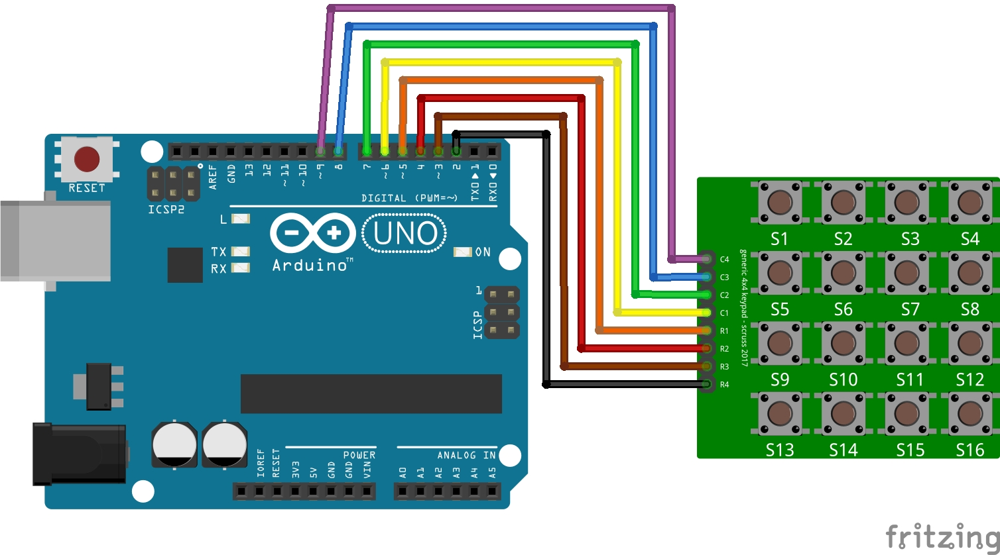

# Lekja 11: Klawiatura 4x4
Podstawowe ćwiczenie z kursu Arduino od **Forbot**

### Czego się nauczyłem:

### Pliki w projekcie:
* `11_klawiatura_4x4` - Kod programu
* `schemat_klawiatura_4x4.jpg` - Schemat połączeń
* `` - Prezentacja działania

### Schemat połączeń:

### Prezentacja działania:

