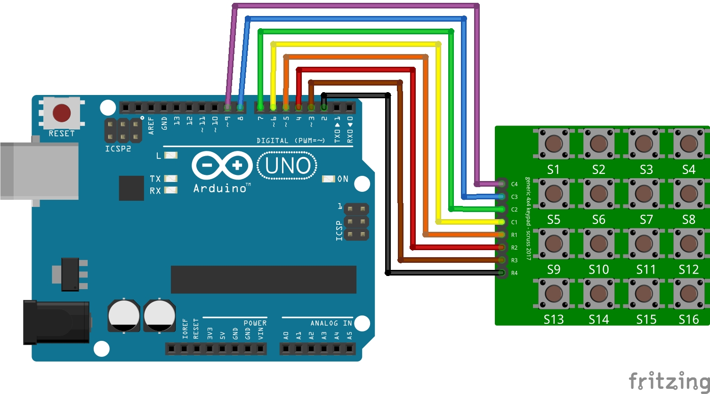
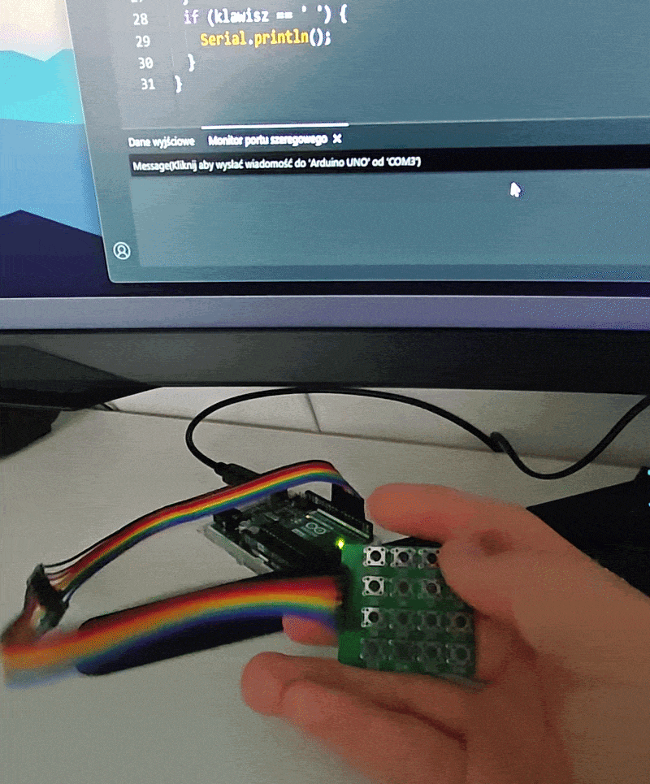

# Lekcja 11: Klawiatura 4x4
Podstawowe ćwiczenie z kursu Arduino od **Forbot**. W tej lekcji zaprogramowałem klawiaturę matrycową 4x4 podłączoną do Arduino, które wysyła wprowadzony ciąg znaków do Monitora Szeregowego w Arduino IDE.

### Czego się nauczyłem:
* Poznałem zasadę działania klawiatury matrycowej.
* Dowiedziałem się, jak ją poprawnie skonfigurować i oprogramować.

### Czym jest klawiatura matrycowa?
Klawiatura matrycowa łączy przyciski w grupy ułożone w kolumny i wiersze. Naciskając wybrany przycisk, zwieramy konkretną kolumnę z konkretnym wierszem, co pozwala mikrokontrolerowi określić, który guzik został wciśnięty. Jest to niezwykle efektywne rozwiązanie – dzięki niemu możemy obsłużyć aż 16 przycisków za pomocą zaledwie 8 przewodów (pinów). Gdybyśmy chcieli podłączyć taką liczbę przycisków w tradycyjny sposób, na standardowym Arduino zabrakłoby wolnych portów I/O.

### Jak skonfigurować klawiaturę matrycową w Arduino IDE?
Najprostszym sposobem na obsługę tego modułu jest użycie biblioteki `Keypad.h`, którą można pobrać bezpośrednio z Menedżera Bibliotek w Arduino IDE.
```C++
#include <Keypad.h> // Dołączenie biblioteki do obsługi klawiatury
```
Następnie musimy zdefiniować wymiary fizyczne klawiatury. W przypadku modelu 4x4 ustawiamy 4 wiersze i 4 kolumny.
```C++
const byte ROWS = 4; // Liczba wierszy
const byte COLS = 4; // Liczba kolumn
```
W kolejnym kroku tworzymy mapę klawiatury, która odwzorowuje fizyczny układ przycisków na konkretne znaki w kodzie.
```C++
char keys[ROWS][COLS] = { // Mapowanie klawiatury
  {'1','2','3','A'},
  {'4','5','6','B'},
  {'7','8','9','C'},
  {'*','0','#','D'}
};
```
Pozostaje nam już tylko utworzenie obiektu klawiatury (inicjalizacja), podając tablicę znaków, przypisane piny wierszy/kolumn oraz jej wymiary.
```C++
Keypad klawiatura = Keypad( makeKeymap(keys), rowPins, colPins, ROWS, COLS ); // Inicjalizacja obiektu klawiatury
```
Aby odczytać, który przycisk został wciśnięty, wykorzystujemy funkcję `.getKey()`.
```C++
char klawisz = klawiatura.getKey();
```

### Pliki w projekcie:
* `11_klawiatura_4x4` – Kod programu
* `schemat_klawiatura_4x4.jpg` – Schemat połączeń
* `prezentacja_dzialania_klawiatura_4x4.gif` – Prezentacja działania projektu

### Schemat połączeń:


### Prezentacja działania:

