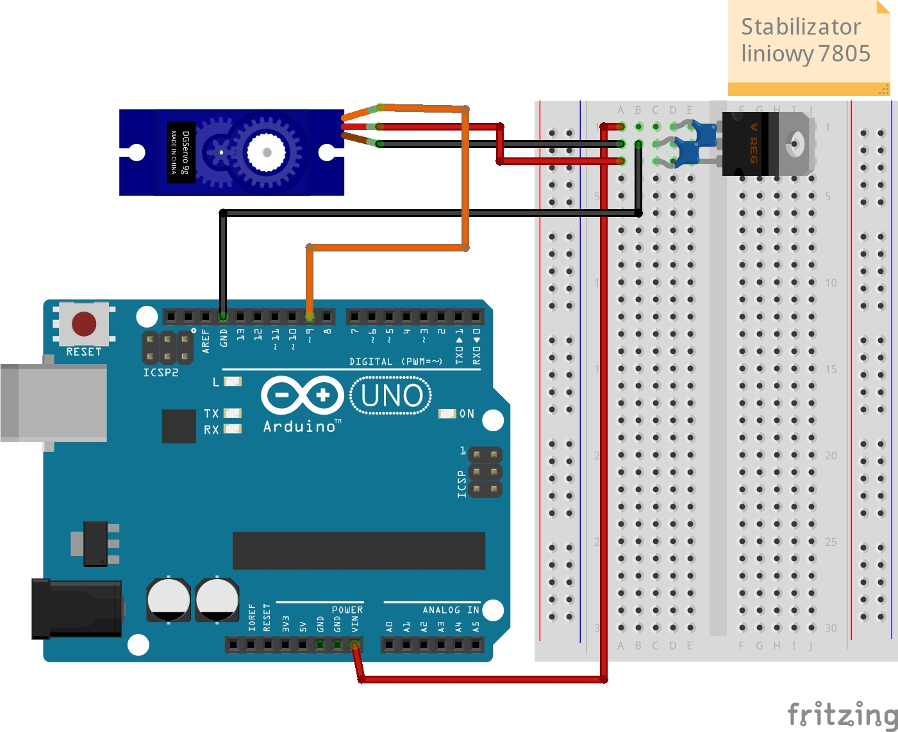

# Lekcja 13: Serwomechanizm cz. 2
Kontynuacja lekcji [12 serwomechanizm cz. 1](Nauka-Arduino/12_serwomechanizm_cz1/) z kursu Arduino od **Forbot**. W tej lekcji napisałem program który powoduje, że Arduino odczytuje dane z monitora portu szeregowego i ustawia odpowiedznio serwo.

### Czego się nauczyłem:
* Przyjmowanie danych z monitora portu szeregowego.
* Przekształcanie danych typu String na dane int.
* Kalibracja serwomechanizmu, żeby wskazywał idealnie wynik na tarczy wsaźnika

### Pliki w projekcie:
* `12_serwomechanizm_2.ino` - Kod programu
* `schemat_serwomechanizm.jpg` - Schemat połączeń (Fritzing)
* `prezentacja_dzialania_serwomechanizm_2.gif` - Prezentacja działania

### Schemat połączeń:

### Prezentacja działania:

