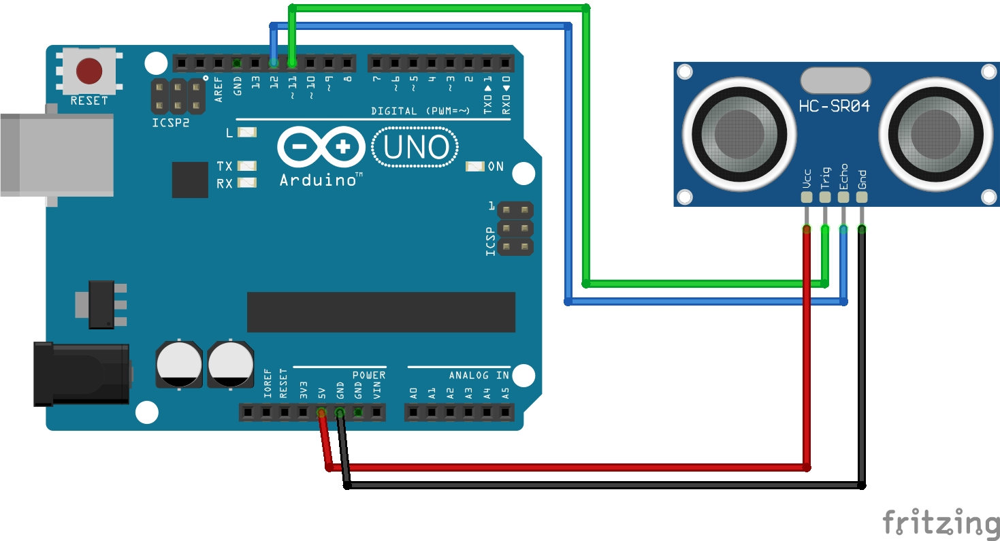
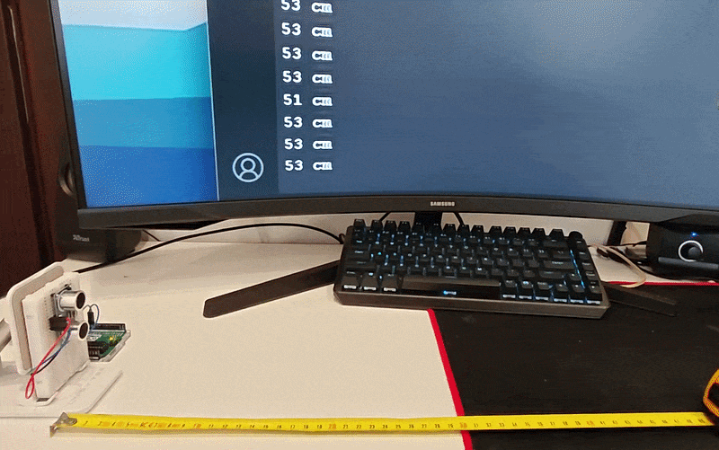

# Lekcja 14: Czujnik odległości HC-SR04

Dzisiaj zająłem się czujnikiem odległości i przygotowałem podstawowy projekt z zastosowaniem modułu **HC-SR04**.

### Czego się nauczyłem:
* Dowiedziałem się, jak działają ultradźwiękowe czujniki odległości.
* Nauczyłem się prawidłowo konfigurować i podłączać czujnik HC-SR04.
* Napisałem program, który wykonuje pomiary odległości i wypisuje wyniki w monitorze portu szeregowego.

### Jak działa ultradźwiękowy czujnik odległości HC-SR04?
Czujnik składa się z nadajnika i odbiornika fal ultradźwiękowych (niesłyszalnych dla człowieka). Nadajnik wysyła sygnał, który odbija się od przeszkody i wraca do odbiornika. Mierząc czas, jaki upłynął między wysłaniem a powrotem fali, możemy obliczyć odległość. Wynik dzielimy przez prędkość dźwięku oraz przez 2 (ponieważ fala pokonuje drogę w obie strony – do przeszkody i z powrotem).

### Jak skonfigurować HC-SR04?
Konfiguracja jest bardzo prosta. Wystarczy podłączyć piny **Trig** (nadajnik) oraz **Echo** (odbiornik) do mikrokontrolera i ustawić je odpowiednio jako wyjście oraz wejście:

```C++
pinMode(TrigPin, OUTPUT); // Ustawienie pinu Trig jako wyjście
pinMode(EchoPin, INPUT);  // Ustawienie pinu Echo jako wejście
```

### Jak wykonać pomiar odległości?
Aby wyzwolić pomiar, musimy wysłać krótki impuls na pin **Trig** przy użyciu funkcji `delayMicroseconds()`. Różnica między nią a zwykłym `delay()` polega na tym, że `delay()` odmierza czas w milisekundach, a `delayMicroseconds()` w mikrosekundach. Czas trwania impulsów (2 µs stanu niskiego i 10 µs stanu wysokiego) wynika bezpośrednio ze specyfikacji producenta.

Następnie mierzymy czas trwania powrotnego impulsu na pinie **Echo** za pomocą wbudowanej funkcji `pulseIn()`. Aby zamienić uzyskany czas na odległość w centymetrach, dzielimy go przez **58** (jest to stała przeliczeniowa podana przez producenta).

```C++
// Generowanie impulsu wyzwalającego (Trig)
digitalWrite(TrigPin, LOW);
delayMicroseconds(2);
digitalWrite(TrigPin, HIGH);
delayMicroseconds(10);
digitalWrite(TrigPin, LOW);

// Pomiar czasu trwania impulsu na pinie Echo
long czas = pulseIn(EchoPin, HIGH); 

// Przeliczenie czasu na odległość w centymetrach
int dystans = czas / 58; 
```

### Schemat połączeń:


### Prezentacja działania:

