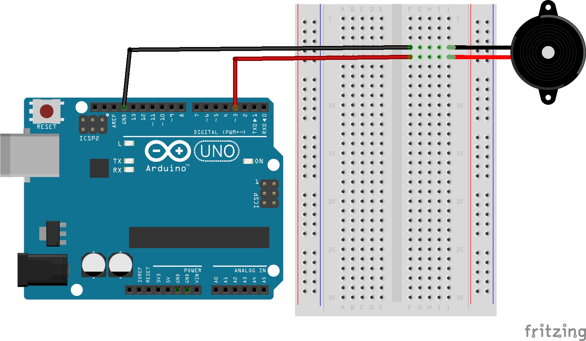

# Lekcja 6: Podstawy buzzera bez generatora
Podstawowe ćwiczenie z wykorzystaniem buzzera pasywnego (bez generatora) z kursu **Arduino cz. 2** od **Forbot**. 
Wyjątkowo nie dodaję prezentacji dziłania przez braku opcji wysyłania dzwięku na GitHuba. Mógłbym wrzucić to na youtuba i udostępnić link ale uważam że efekt nie jest warty zachodu.

### Czego się nauczyłem:
* Dowiedziałem się że buzzery pasywne wymagają podania sygnału o konkretnej częstotliwości, aby wydać dźwięk.
* Poznałem funkcję `tone()` która podaje właśnie sygnał o konkretnej częstotliwości, aby wydać dźwięk.
* Funkcja `noTone()` która przerywa działanie buzzera.
* Poznałem ograniczenie Arduino związane z funkcją `tone()`.

### Ważna uwaga: Konflikt z PWM
Funkcja `tone()` korzysta z wewnętrznego licznika procesora Timer2. Ten sam licznik jest odpowiedzialny za sygnał PWM na pinach 3 oraz 11.
Oznacza to tyle że podczas wykonywania funkcji `tone()` sygnał PWM na pinach 3 i 11 nie będzie działał prawidłowo.
Jeżeli projekt wymaga pinu PWM i jednoczesnego wydawania dźwięku przez buzzer pasywny musimy korzystać z pozostałych pinów PWM (5,6,9,10) które korzystają z innych timerów.

### Pliki w projekcie:
* `podstawy_buzzera_bez_generatora.ino` - Kod programu
* `schemat_podstawy_buzzera_bez_generatora.jpg` - Schemat połączeń (Fritzing)

### Schemat połączeń:
